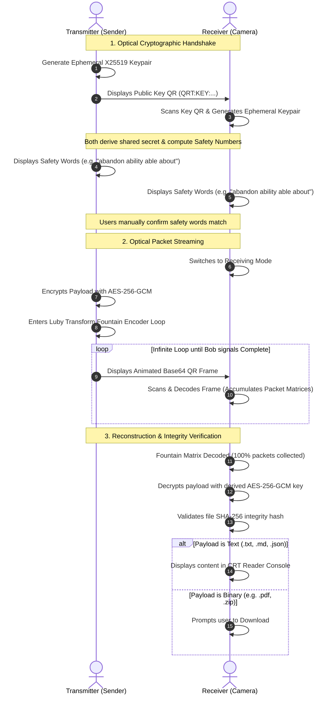

# Data-Wormhole 🌀

> **Decentralized, Air-Gapped, Peer-to-Peer File & Data Sharing via Animated QR Codes.**

---

Data-Wormhole is an enterprise-grade, zero-trust file transmission platform that enables secure data sharing between completely offline, air-gapped devices. By utilizing animated QR codes as a high-density, lossy optical channel, Data-Wormhole bypasses all network dependencies (WiFi, Bluetooth, cellular, internet) and local hardware pairings. 

If one device has a screen and the other has a camera, they can securely exchange files.

---

## Key Features

### 🛡️ Enterprise Cryptography
- **Key Exchange (X25519 ECDH):** Ephemeral keypairs generated on-the-fly per transfer, ensuring perfect forward secrecy.
- **Payload Encryption (AES-256-GCM):** Authenticated encryption for all data packets.
- **MITM Protection (BIP39 Safety Numbers):** Signal-style 4-word human-verifiable checksums computed on both ends to verify channel safety.
- **Integrity Validation (SHA-256):** Complete verification of file assembly to prevent corrupted file writes.

### ⚡ Optical Fountain Streaming (LT Codes)
- **Luby Transform (LT) Fountain Codes:** Encodes the file into an endless stream of animated packets. 
- **Lossy Channel Immunity:** The receiver does not need to capture every frame or scan them in order. As long as it captures any random subset of packages (usually ~105% of the file size), it can mathematically reconstruct the entire file.
- **Adaptive Rates:** High-contrast frames and tunable transmission rates (up to 15 FPS) optimize scan success across different cameras and screens.

### 📱 Developer & Enterprise Reusability
- **Web PWA (`app/`):** React + TypeScript + TailwindCSS + Vite front-end. Secure context-enabled camera parser, and an embedded CRT-themed reader console to view text payloads immediately without downloading.
- **Rust Core Protocol (`qr-transfer/`):** Highly performant and secure Rust implementation of the encoder, decoder, and cryptographic engine.

---

## Architecture Flow



---

## Directory Structure

```
Data-Wormhole/
├── app/                  # React + TypeScript + Vite PWA (Web client)
│   ├── src/
│   │   ├── App.tsx       # Main UI, Video camera stream, and CRT console
│   │   ├── lib/
│   │   │   ├── crypto.ts # Browser Web Crypto API (X25519, AES-GCM)
│   │   │   └── logger.ts # Retro terminal logs recorder
│   └── package.json
├── qr-transfer/          # Rust reference crates & command line client
│   ├── crates/           # Core Rust library modules
│   └── Cargo.toml        # Cargo workspace definition
├── LICENSE               # Apache License 2.0
└── README.md             # This document
```

---

## Quick Start

### 1. Web client (PWA)

To run the React front-end locally:

```bash
# Navigate to web application directory
cd app

# Install dependencies
npm install

# Run Vite dev server (requires secure context HTTPS or localhost for camera access)
npm run dev

# Build for production
npm run build
```

### 2. Rust CLI & Modules

To build and compile the Rust workspace:

```bash
# Navigate to Rust folder
cd qr-transfer

# Build workspace in release mode
cargo build --release

# Run unit tests
cargo test --workspace
```

---

## Security Protocol Details

- **Cryptographic Ephemeral Agreement:** Both devices generate unique X25519 keypairs. The private keys never leave their respective memory space.
- **Symmetric Encryption:** Ephemeral shared secret derives an AES-256 key and a 96-bit IV via HKDF (SHA-256).
- **Anti-MITM Verification:** A Signal-compatible safety number is computed via SHA-256 of the combined public keys and shared salt, mapped to 4 words from the BIP-39 English dictionary.

---

## License

Data-Wormhole is open-source software dual-licensed under the terms of the **Apache License 2.0** and **MIT License**.
See the [LICENSE](LICENSE) file for details.
