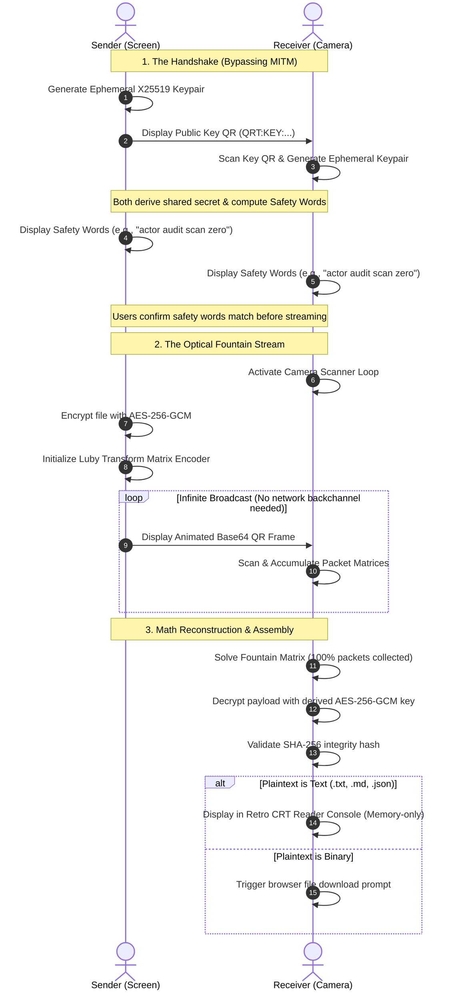

# Data-Wormhole 🌀

> **"Oh, your SOC blocked USBs and put a proxy on the network? Cute."**
> 
> A decentralized, tinfoil-hat grade, screen-to-camera optical exfiltration and file sharing tool powered by animated QR codes and fountain codes. Bypasses networks, endpoint policies, and corporate audit logs.

---

So, some compliance auditor checked a box, and now your enterprise has blocked USB drives, disabled Bluetooth, shut down external web traffic, and put a decrypting SSL proxy on the firewall. 

Meet **Data-Wormhole**. 

It’s an optical covert channel that turns any screen-and-camera pair into an air-gap crossing data pipeline. By converting files into high-density, mathematical streams of animated QR frames, it bypasses every network dependency (WiFi, Bluetooth, cellular, internet) and endpoint hardware restriction. 

If one device has a screen and the other has a camera, you are sharing files. No pairing, no network packets, no audit logs for the SOC analyst to cry over.

---

## ⚡ The Tech (Why It Works)

### 1. Optical Fountain Streaming (Luby Transform Codes)
Unlike standard file transfer tools, Data-Wormhole doesn't just display a sequence of QR codes that you have to scan in order. Instead, it runs the payload through a **Luby Transform (LT) Fountain Encoder**.
- **Infinite Math Stream:** The sender generates an endless stream of randomized packets.
- **Lossy Channel Immunity:** If a camera glare ruins 5 frames, or you blink, or the frame rate drops, **it does not matter**. The receiver does not need to scan them in order. As long as the camera captures *any* random subset of frames totaling ~105% of the file size, it mathematically solves the linear equations and reconstructs the original file.
- It's like filling a glass under a running tap—it doesn't matter which individual drops make it in, as long as you catch enough of them to fill the glass.

### 2. Tinfoil-Hat Cryptography
We don't do security-theater. 
- **Ephemeral Key Exchange (X25519 ECDH):** Both terminals generate temporary, single-use keypairs on-the-fly. The private keys never touch the disk or the network. Perfect forward secrecy—if someone steals your device tomorrow, they can't decrypt yesterday's stream.
- **Payload Encryption (AES-256-GCM):** Authenticated encryption locks down the payload before it ever becomes a pixel on the screen.
- **Signal-Style Safety Numbers (BIP39 Mnemonic):** To prevent active Man-in-the-Middle (MITM) attacks (like someone showing you a fake key QR), both terminals hash the public parameters and map them to a 4-word BIP39 sentence (e.g., `"abandon ability able about"`). Verify the words match on both screens, and you are mathematically guaranteed a secure channel.
- **SHA-256 Integrity Verification:** Post-reassembly check to make sure not a single bit was corrupted in flight.

### 3. Choose Your Weapon
- **The CRT Terminal PWA (`app/`):** A retro, green/amber CRT-themed React + Vite PWA. It has adjustable FPS throttles, QR density controls, and an integrated reader console to view text payloads immediately in-memory without letting the host OS write it to the Downloads folder.
- **The Rust Core CLI (`qr-transfer/`):** A lightning-fast Rust implementation of the protocol suite for scriptable, headless operations.

---

## 📐 Architecture Flow



---

## 🛠️ Installation & Setup

### 1. The Web Interface (PWA)
Needs a **Secure Context** (HTTPS or `localhost`) because modern browsers rightly treat camera sensors as sensitive APIs.

```bash
# Slide into the web folder
cd app

# Fetch dependencies
npm install

# Fire up the Vite local dev server
npm run dev

# Pack it for production deployment
npm run build
```
*Tip: If you're scanning from a mobile device, host this on local HTTPS or use an SSH/development tunnel.*

### 2. The Rust Core & CLI
Compile the workspace and play around with the engine directly:

```bash
# Hop into the Rust project
cd qr-transfer

# Compile everything in release mode
cargo build --release

# Run the suite's test coverage
cargo test --workspace
```

---

## 💻 Rust CLI Usage Guide

The CLI client (`qr-cli`) handles key management, encryption, encoding, and parsing. Here is how to use it:

### Key Generation
Generate a local raw keypair for offline scripting:
```bash
./target/release/qr-cli keygen --out-pub public.key --out-priv private.key
```

### Sending / Encoding a File
Split and encrypt a file into raw animated-compatible payloads:
```bash
# Generates a stream of packet blocks from confidential_payload.docx
./target/release/qr-cli send --file confidential_payload.docx --block-size 200
```

### Receiving / Decoding
Collect streamed packets and reconstruct them:
```bash
# Rebuild the file from gathered inputs
./target/release/qr-cli receive --input directory_of_scanned_blocks/ --output recovered_file.docx
```

### Benchmarks
Run a local simulation of the fountain encoder/decoder pipeline to test speed and throughput:
```bash
./target/release/qr-cli benchmark
```

---

## 🚨 Data Loss Prevention (DLP) Implications

If you are a security lead, this tool should keep you awake at night. Here is the threat analysis of why optical covert channels are a blind spot for enterprise security.

### The Attack Vector
- **Zero Network Fingerprint:** Traditional network DLPs monitor HTTP uploads, FTP transfers, SMTP attachments, and DNS queries. Data-Wormhole sends **zero packets** over the network.
- **Zero Endpoint Storage Events:** Endpoint agents trigger alerts when a user copies files to a USB drive or an unapproved external hard drive. Since the browser PWA works entirely in-memory and displays data optically, it triggers no USB mount events or hardware modification alerts.
- **Visual Exfiltration:** A disgruntled employee with camera access on their phone can simply scan their work monitor, exfiltrating source code, customer records, or API keys directly from their browser window.

### Enterprise Mitigations (How to Defend)
If you want to block optical exfiltration like this in your high-security zones:
1. **Camera Block Policies (MDM):** Enforce MDM profile policies that completely disable the webcam/camera hardware on corporate laptops and block personal phones in secure workspace environments.
2. **Browser API Restrictions (Chrome Policies):** Use enterprise group policies to disable browser access to `getUserMedia` and the camera API except for verified, whitelisted domains (e.g., video conferencing).
3. **Flashing Screen Detection:** Implement endpoint-based behavior monitoring that flags user-space applications displaying high-frequency, high-contrast canvas redraws (often indicative of QR streams).
4. **Physical Workspace Isolation:** Strict "no personal devices" rules in environments handling critical IP or government data.

---

## 📄 License
Dual-licensed under the **Apache License 2.0** and the **MIT License**. Read the [LICENSE](LICENSE) file for the legal fine print.
